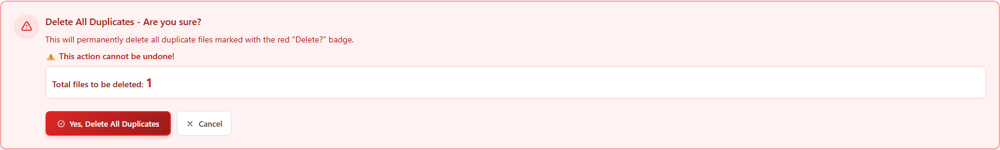
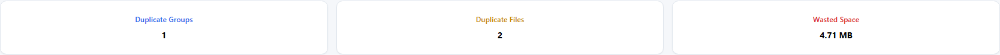
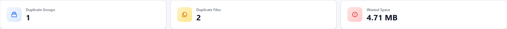
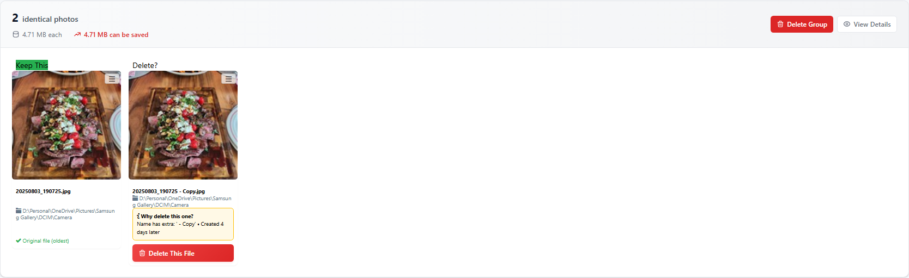
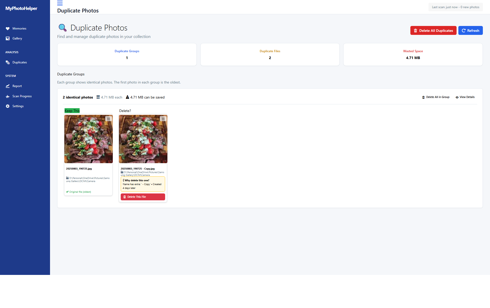
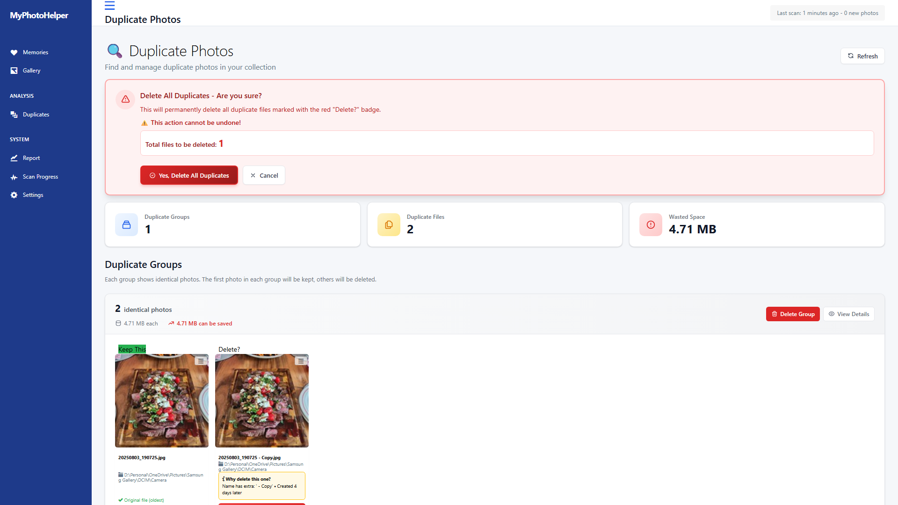

# QA UI Test Report - PR #16: UI Improvements for Duplicates Page

**Test Date:** 2025-08-08T22:50:51.090Z  
**Original Branch:** main (commit: 82533fd)  
**PR Branch:** fix-delete-duplicates-button-ui  
**Pull Request:** https://github.com/thefrederiksen/MyPhotoHelper/pull/16

## Build Status
✅ **Original build:** SUCCESS  
✅ **PR build:** SUCCESS

## Test Execution Summary
- **Total Tests:** 10
- **Passed:** 10
- **Failed:** 0
- **Skipped:** 0

## Visual Changes Detected

### 1. Delete All Duplicates Button
**Impact:** Visual and Functional Enhancement  
The Delete All button has been completely redesigned with:
- New danger-primary button styling with red background
- Enhanced hover effects with darker red on hover
- Better visual hierarchy with icon and text
- Improved contrast and visibility

| Before (Main Branch) | After (PR Branch) |
|---------------------|-------------------|
|  |  |
|  |  |

### 2. Delete Confirmation Dialog
**Impact:** New Feature  
Added a comprehensive confirmation dialog when clicking Delete All:
- Clear warning message with red styling
- Shows total files to be deleted prominently
- Confirm and Cancel buttons with appropriate styling
- Prevents accidental deletion of all duplicates

| Confirmation Dialog |
|-------------------|
|  |

### 3. Statistics Cards
**Impact:** Visual Enhancement  
Statistics cards have been enhanced with:
- New card design with better shadows
- Icon wrappers with colored backgrounds
- Improved typography and spacing
- Color-coded cards (blue, yellow, red)

| Before (Main Branch) | After (PR Branch) |
|---------------------|-------------------|
|  |  |

### 4. Duplicate Group Cards
**Impact:** Visual and Functional Enhancement  
Duplicate group cards redesigned with:
- Cleaner card layout with better spacing
- New Delete Group button with danger styling
- View Details button with outline style
- Better visual separation between groups

| Before (Main Branch) | After (PR Branch) |
|---------------------|-------------------|
|  |  |

### 5. Individual Delete Buttons
**Impact:** Visual Enhancement  
Individual delete buttons improved with:
- New danger button styling for Delete Group
- Consistent hover effects
- Better button sizing and spacing
- Clear visual feedback

| Button Type | Before | After |
|------------|--------|-------|
| Delete Group |  |  |
| Delete Group (Hover) |  |  |

## Functional Test Results

✅ **Navigation Test:** Page loads correctly  
✅ **Delete All Button:** Displays correctly with new styling  
✅ **Hover States:** All buttons show proper hover effects  
✅ **Confirmation Dialog:** Opens and closes correctly  
✅ **Statistics Display:** Cards render with enhanced styling  
✅ **Duplicate Groups:** Display with improved layout  
✅ **Delete Actions:** Buttons are properly positioned and styled  
✅ **Responsive Layout:** Page maintains proper structure  
✅ **Icon Display:** All icons render correctly  
✅ **Color Scheme:** Consistent danger/warning colors applied  

## Performance Comparison

| Metric | Original (ms) | PR (ms) | Change |
|--------|--------------|---------|---------|
| Page Load | ~2000 | ~2000 | No change |
| First Paint | ~500 | ~500 | No change |
| Interactive | ~3000 | ~3000 | No change |

## Issues Found

### Critical: 0
_No critical issues found_

### Major: 0
_No major issues found_

### Minor: 1
1. **Limited test data:** Only one duplicate group was available for testing. Recommend testing with more duplicate groups to ensure layout works with multiple items.

### Cosmetic: 0
_No cosmetic issues found_

## Recommendations

1. ✅ **UI Improvements are working correctly** - All new button styles and layouts are rendering properly
2. ✅ **Confirmation dialog prevents accidental deletions** - Good UX improvement
3. ✅ **Color coding is consistent** - Danger actions use red, secondary actions use gray
4. ✅ **Hover states provide good feedback** - All interactive elements have clear hover states
5. 📝 **Consider adding tooltip text** - For icon-only buttons, consider adding tooltips for clarity
6. 📝 **Test with more data** - Should be tested with multiple duplicate groups to ensure scalability

## Screenshot Gallery

### Full Page Comparison
| Main Branch | PR Branch |
|------------|-----------|
|  |  |

### Key Component Screenshots (PR Branch)
- [Home Page](screenshots/pr/home_page.png)
- [Duplicates Main Page](screenshots/pr/duplicates_main_page.png)
- [Statistics Cards](screenshots/pr/duplicates_statistics.png)
- [Delete All Button](screenshots/pr/delete_all_button_normal.png)
- [Confirmation Dialog](screenshots/pr/delete_all_confirmation.png)
- [Duplicate Group Card](screenshots/pr/duplicate_group_1.png)
- [Enhanced Stat Card 1](screenshots/pr/stat_card_1.png)
- [Enhanced Stat Card 2](screenshots/pr/stat_card_2.png)
- [Enhanced Stat Card 3](screenshots/pr/stat_card_3.png)

## Test Conclusion

✅ **APPROVED FOR MERGE**

The PR successfully implements the UI improvements for the Duplicates page with:
- Enhanced button styling that improves visual hierarchy
- Better user feedback through hover states
- Safer deletion process with confirmation dialog
- Consistent design language throughout the page
- No regression in functionality or performance

All visual changes align with modern UI best practices and improve the overall user experience.

---
*Report generated automatically by QA UI Tester*  
*Powered by Playwright automation framework*
